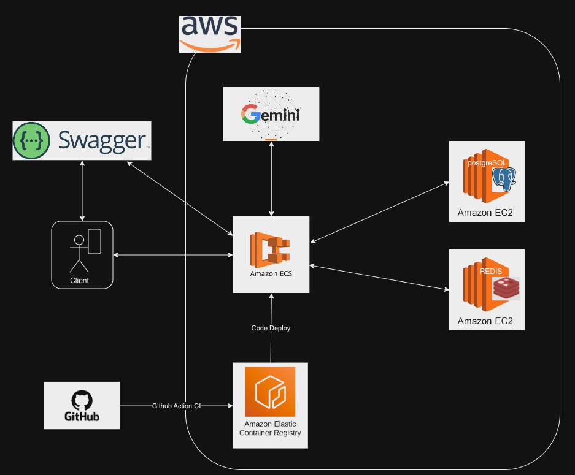

# 8조 배달서비스 프로젝트
팀원 : 고혁진 , 조민수 , 김홍성

## 프로젝트 목적

이 프로젝트의 목표는 배달 서비스를 효율적으로 구현하여 사용자에게 원활한 배달 경험을 제공하는 것입니다. 이를 통해 사용자 편의성을 높이고, 운영 효율성을 개선하며, 비즈니스 성과를 향상시키는 것을 목표로 합니다.

## 서비스 구성 및 실행 방법

이 서비스는 다음과 같은 구성 요소로 이루어져 있습니다:
- **백엔드 API(Springboot)**: 주문 처리 및 배달 관리 기능을 제공하는 서버.
- **데이터베이스(PostgreSQL)**: 주문 및 사용자 데이터를 저장하고 관리합니다.
- **케시(Redis)**: 사용자의 인증 정보를 관리하는 캐시 서버

**실행 방법:**
1. **프로파일 설정**: Local 환경에서 구동 시 active.profile 을 'local' 로 설정 해주시기 바랍니다. 
2. **횐경변수 설정**: PostgreSQL와 Redis 의 datasource, gemini apikey 를 local properties 파일에서 key 값에 일치하는 값을 입력합니다.  
3. **객체 생성 순서**: USER -> 카테고리 -> 레스토랑 -> 상품 -> 주문, AI -> REPORT, REVIEW etc.

## Infra Structure

## ERD

## 조민수 PART

조민수는 프로젝트의 다음 부분을 담당했습니다:
- **프로젝트 설정**: 
  - **Spring Security with JWT**: JWT와 Spring Security 를 결합한 보안쳬게 수립
  - **Swagger 설정**: API 실행 테스트에 용이한 Swagger 설정
  - **Redis 설정**: 사용자 인증정보 캐싱를 위한 Redis 설정
  - **응답 객체 공통화**: API 결과를 보다 직관적으로 확인할 수 있도록 응답객체 공통화를 위한 RestControllerAdvice 설정 
- **기능 개발**: 
  - **인증(Auth)**: 로그인, 회원가입의 기능 개발
  - **사용자(User)**: 사용자 정보 조회 및 관리(수정, 삭제) 기능 개발
  - **생성형 AI(AI)**: AI 응답 생성 및 조회, 관리(삭제) 기능 개발
  - **리뷰(Review)**: 리뷰 생성 및 조회, 관리(삭제) 기능 개발
  - **신고 내역(Report)**: 신고 내역 생성 및 조회, 관리(삭제) 기능 개발
- **배포**: 
  - **PostgreSQL**: EC2 에 Postgre DB 세팅

## 김홍성 PART

김홍성은 프로젝트의 다음 부분을 담당했습니다:

- **기능 개발**:
  - **카테고리**: 카테고리 생성, 조회, 수정 및 삭제 기능 구현.
  - **레스토랑**: 레스토랑 등록, 정보 조회, 수정 및 삭제 기능 구현.
  - **상품**: 상품 추가, 조회, 수정 및 삭제 기능 구현.
  - **공지사항**: 공지사항 작성, 조회, 수정 및 삭제 기능 구현.

- **Redis 서버 배포**: 도커, 도커컴포즈와 EC2를 사용하여 Redis 서버를 설정하고 배포했습니다.

## 고혁진 PART

고혁진은 프로젝트의 다음 부분을 담당했습니다:

- **기능 개발**:
  - **주문**: 주문 생성, 조회, 수정 및 삭제 기능 구현.
  - **결제**: 결제 등록, 조회, 수정 및 삭제 기능 구현.

- **Spring Boot CI/CD 파이프라인 구축**: AWS ECS 및 ECR을 이용한 자동화 배포 GitHub Actions를 통해 코드 푸시 시 자동으로 빌드 및 Docker 이미지를 생성.   

## APIs 결과
각 API의 예시 요청 및 응답 결과는 [여기](http://delivery-lb-1253848622.ap-northeast-2.elb.amazonaws.com/swagger-ui/index.html)에서 확인하실 수 있습니다.

## 프로젝트를 진행하며 어려웠던 점

**조민수** : 

**김홍성** : 프로젝트 초기에 DB설계가 제대로 이루어지지 않고 생각하는 프로세스들이 달라서 처음 API명세서를 작성하는게 힘들었습니다.

**고혁진** :ECS/ECR을 설정하고 GitHub Actions를 통해 CI/CD 배포를 진행하면서 Redis, PostgreSQL 등 다양한 기술을 사용하는 과정에서 수정해야 할 부분들이 발생했습니다.
에러를 마주했을 때, 처음에는 문제의 원인을 파악하기 어려워 상당히 힘들었습니다.
하지만 튜터님과 팀원들과의 논의를 통해 해결 방법을 찾아갈 수 있었고, 이 과정을 통해 문제 해결 능력을 키울 수 있었습니다.

## 프로젝트를 마무리하며 느낀 점

**조민수** : 
테스트 코드를 작성 못한 점, 페이징을 커서기반으로 했으면 좋았을 것 같다는 걸 늦게 깨달아 조금 아쉽고, 
클라우드 환경에서 CI/CD를 구축하는 경험이 좋았습니다. 
협업하는 팀원들과 의견을 서로 적극적으로 공유하며 프로젝트의 이해도를 높힐 수 있었습니다.
그 결과 서로가 같은 목표를 가지고 나아갈 수 있었던 것 같습니다.
함께 해주신 팀원들께 감사하고, 앞으로도 화이팅하길 바랍니다.

**김홍성** : 
우선 테스트코드들을 제대로 작성하지 못한게 아쉽고
팀원들과 주제를 정하고 정기적인 커뮤니케이션 하는 시간을 정해뒀으면 좋았을것 같습니다.
마지막으로 협업툴에 의지해서 커밋 메세지에 의지하면서 프로젝트의 현재상황들을 계속 파악했는데
지속적으로 문서화 했으면 더 좋았을것같습니다. 마지막으로 좋으신분들 팀원으로 만나서 재밌게 개발했습니다 감사합니다.

**고혁진** : 
프로젝트를 팀 단위로 진행할 때, 코드에서도 공통 코드로 설정해야 하는 부분이 매우 많다는 것을 느꼈습니다.
예를 들어, Response 형식, Entity Auditing, Security, 패키지 구조, 아키텍처 등
코드뿐만 아니라, 처음 프로젝트를 시작할 때 ERD 설계, 도메인 테이블 정의, API 작성 등 팀 단위로 기본 설정해야 할 부분이 많았는데, 프로젝트 경험이 풍부한 팀원분들이 이끌어주신 덕분에 잘 마무리할 수 있었습니다.
이번 프로젝트를 통해 기초 세팅의 중요성을 다시 한번 깨닫게 되었습니다.
